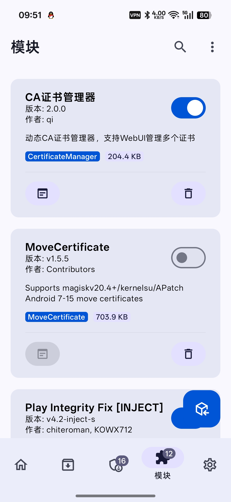
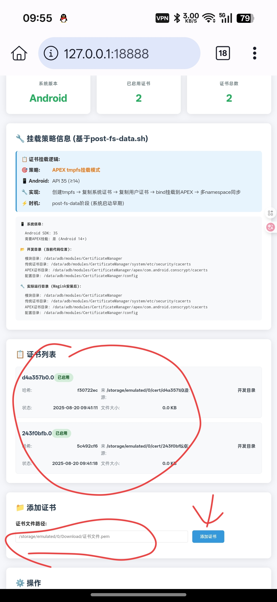

# 📱 CertificateManager

一个用于 Android 设备的证书管理工具，基于 Magisk 模块实现。

## 🚀 安装步骤

### 1. 安装 Magisk 模块
- 导入 zip 文件到 Magisk
- 点击安装
- 重启设备

### 2. 配置 Python 环境
在 Android 设备上需要使用 Termux 安装 Python 环境：
- 依赖库无需额外安装
- 全部使用原生环境搭建

## 📋 使用说明

### 1. 启动服务
打开浏览器访问：`http://127.0.0.1:18888/`

### 2. 添加证书
1. 输入证书的**绝对路径**
2. 点击"添加"按钮
3. 如需添加多个证书，重复以上操作

### 3. 完成配置
最后重启设备即可生效。

---

> **注意**: 请确保证书路径正确，且具有相应的读取权限。
